# Praktikum Web Framework - UCP 1
# Dara S Darmawan - 20230140140

## Todo & Category Management

# 1. Todo Category

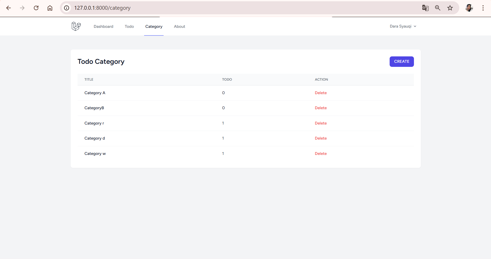

---

# 2. Create Category

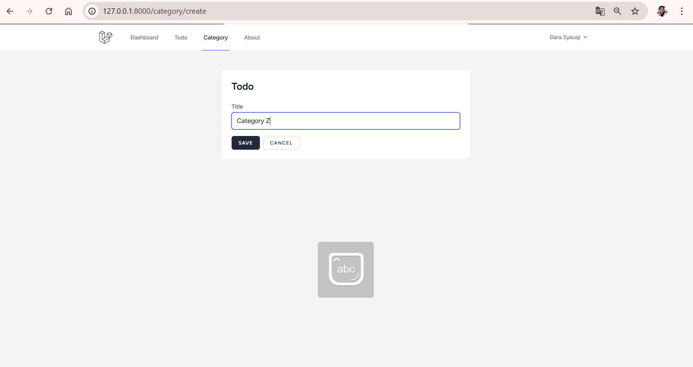

---

# 3. After Create Category

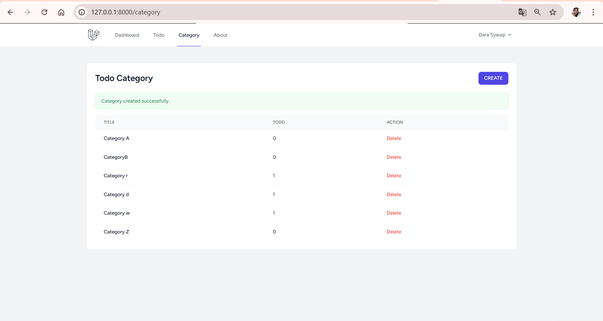

---

# 4. Todo Page

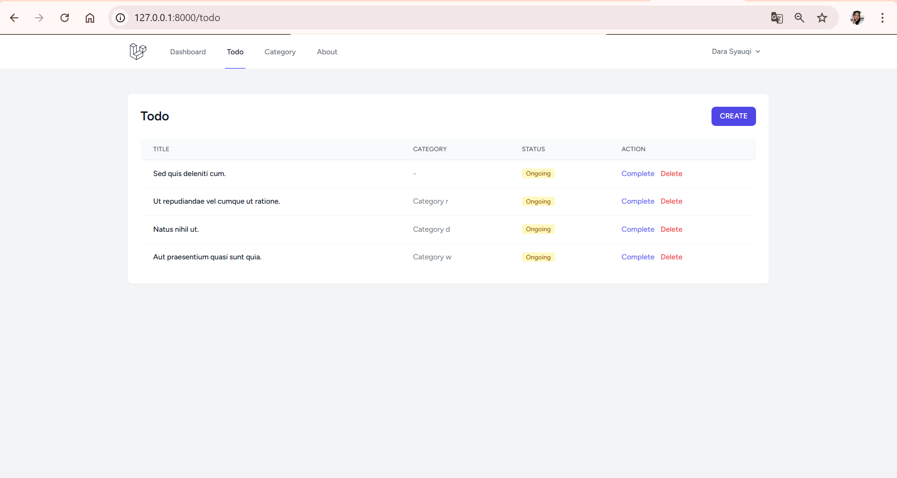

---

# 5. Todo List

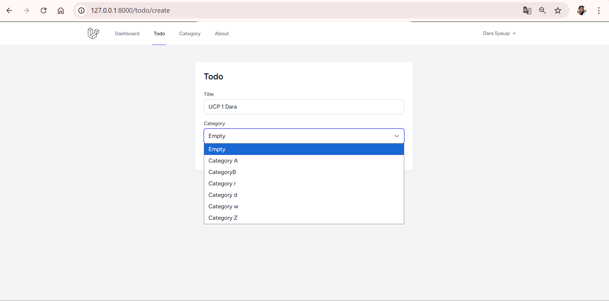

---

# 6. Todo Create

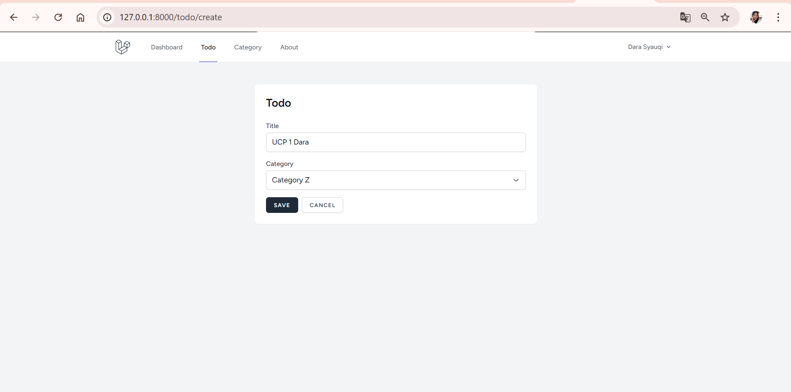

---

# 7. After Create Todo

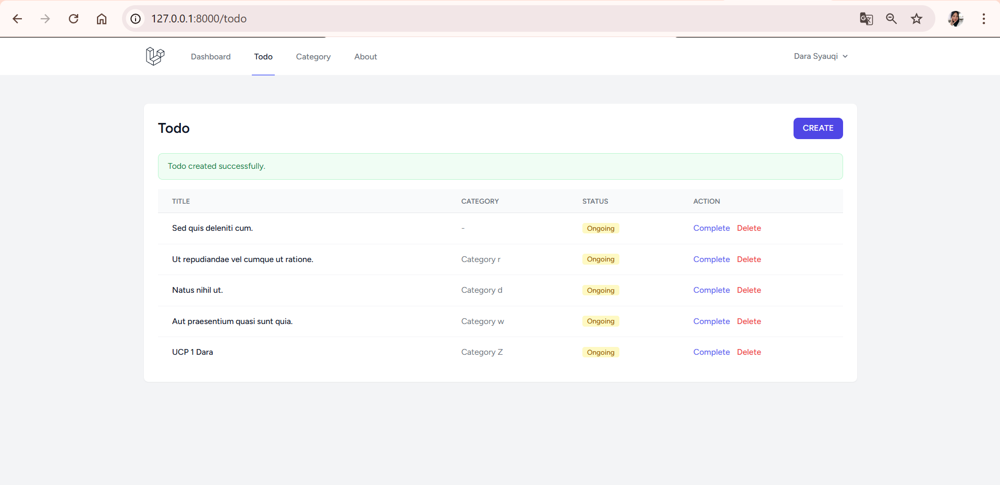

---

# 8. After Create Todo (Category)

-UCP1.png)

---

# 9. Todo Complete

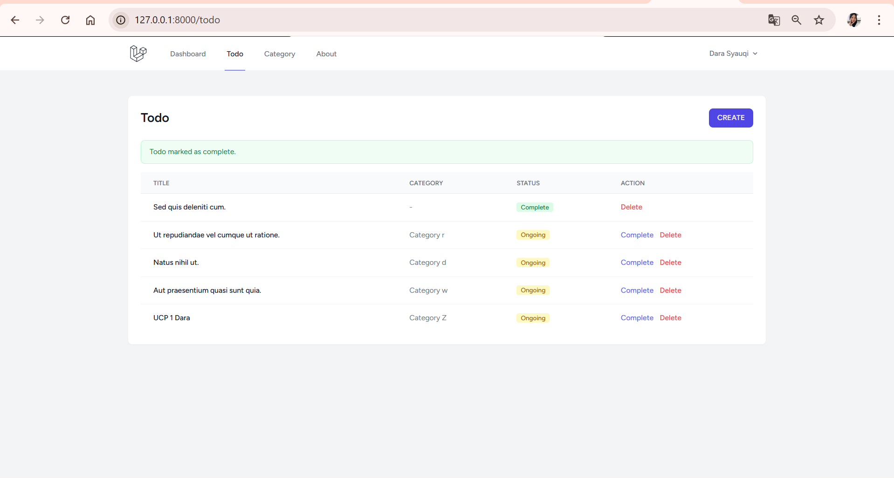

---

# 10. Todo Delete

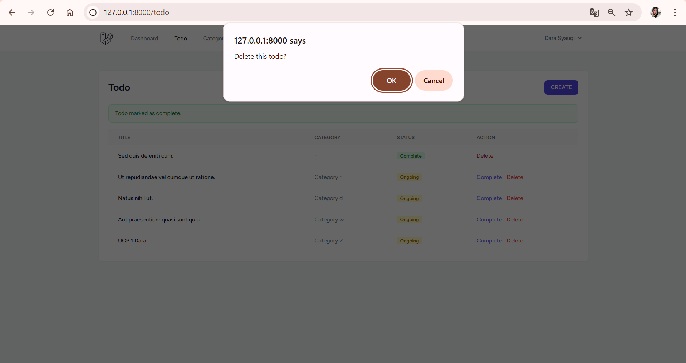

---

# 11. Delete Category

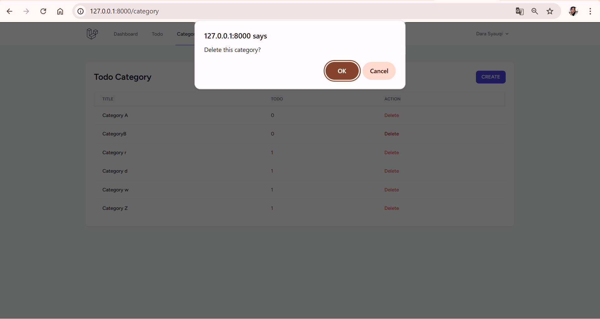

---

# 12. Database Categories

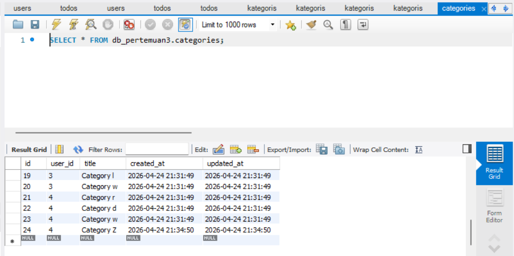

---

# 13. Database Todos

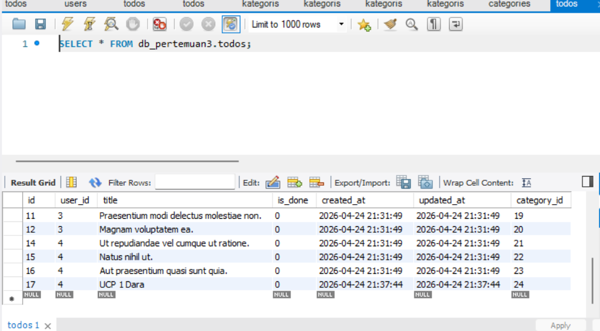

---

# 14. Changes

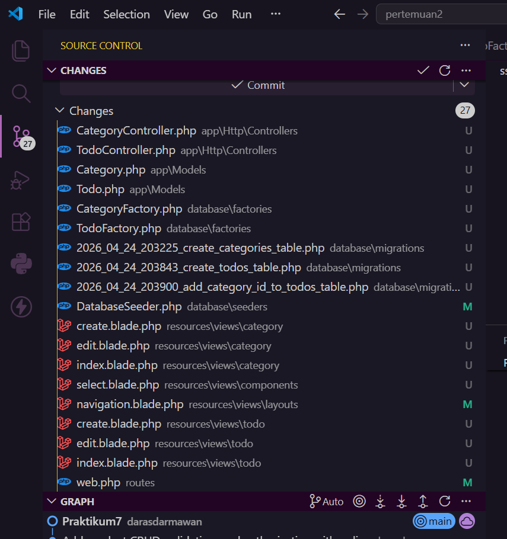