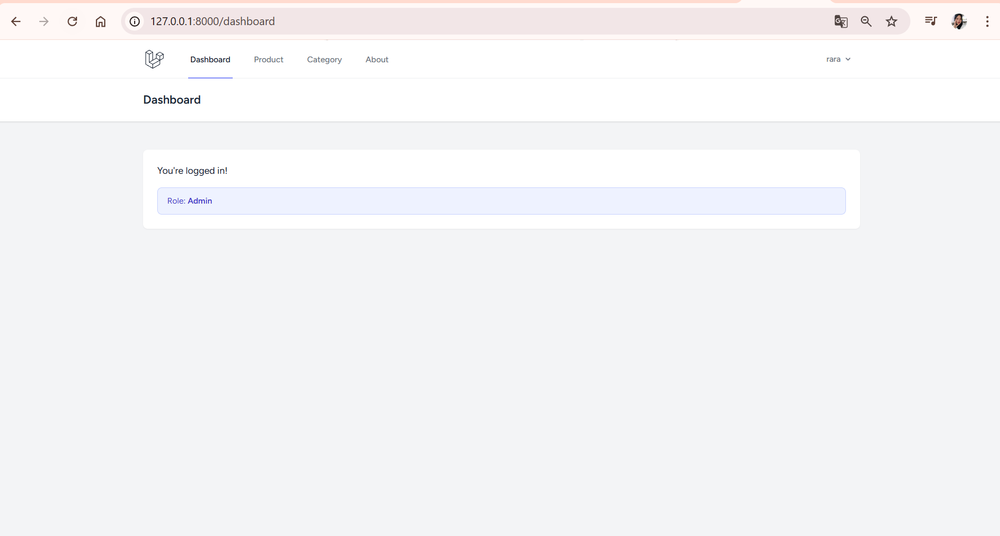
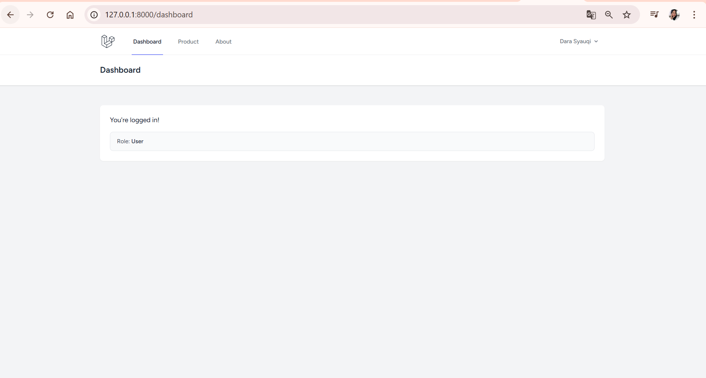
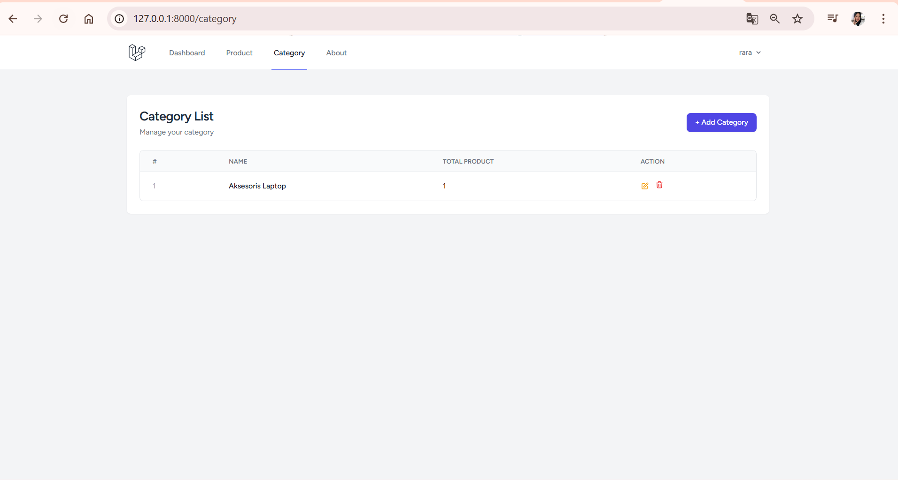
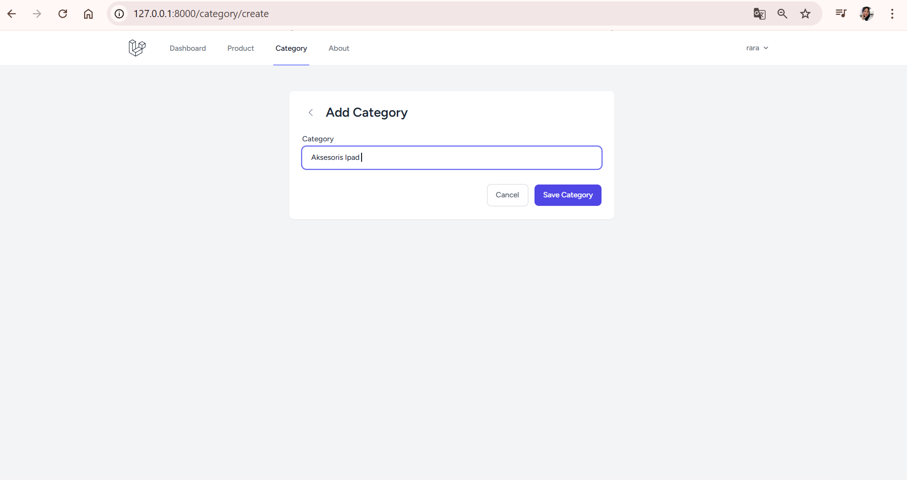
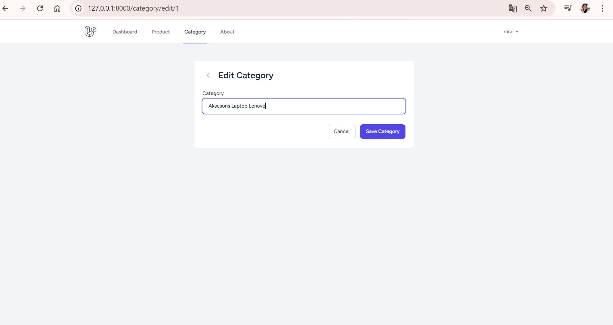
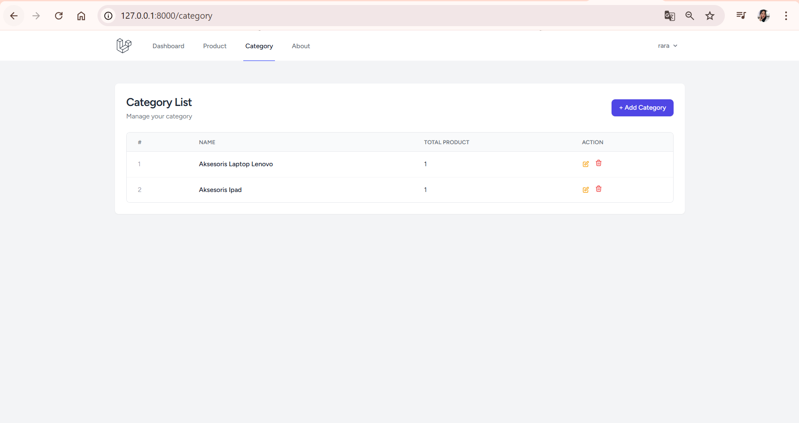
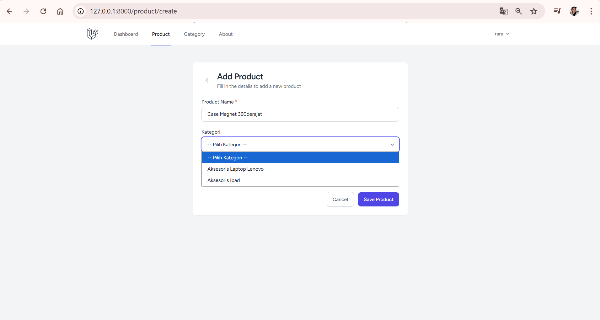
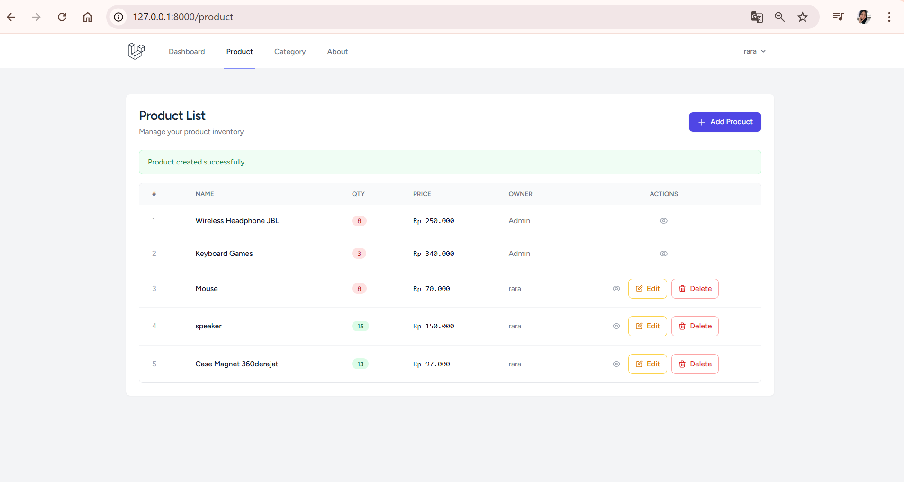
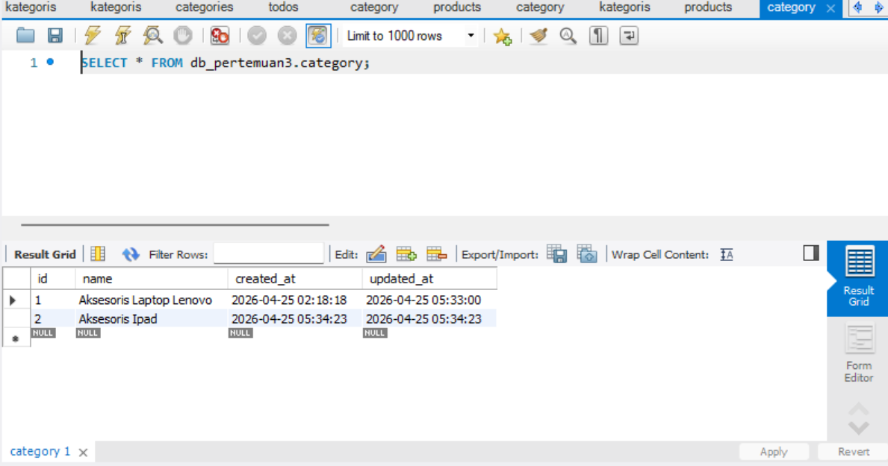
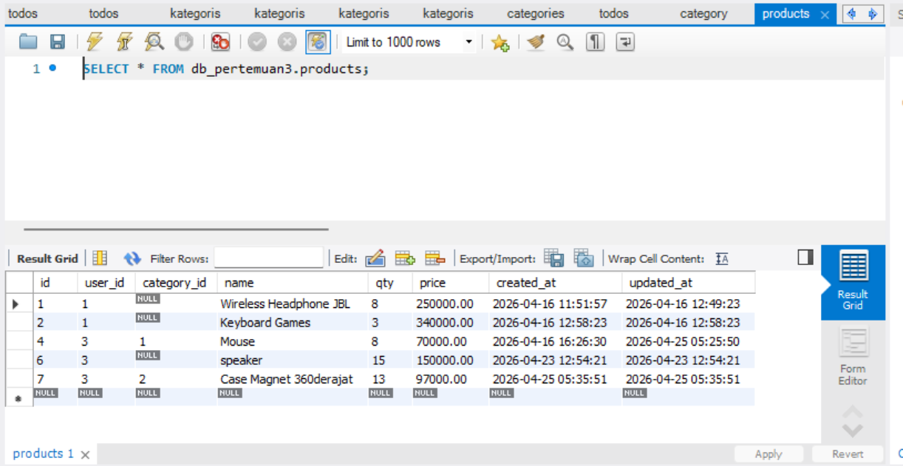

# Praktikum Web Framework - UCP 1
# Dara Syauqi Darmawan - 20230140140

## Category & Product Relationship

---

# 1. Dashboard Admin

---

# 2. Dashboard User

---

# 3. Category List

---

# 4. Add Category

---

# 5. Edit Category

---

# 6. Delete Category

---

# 7. Category List Setelah Add Product

---

# 8. Add Product (dengan Kategori)

---

# 9. Product List

---

# 10. Database Category

---

# 11. Database Product

