# Praktikum Web Framework - Pertemuan 7

## Component & View Product

# 1. Component Add Product

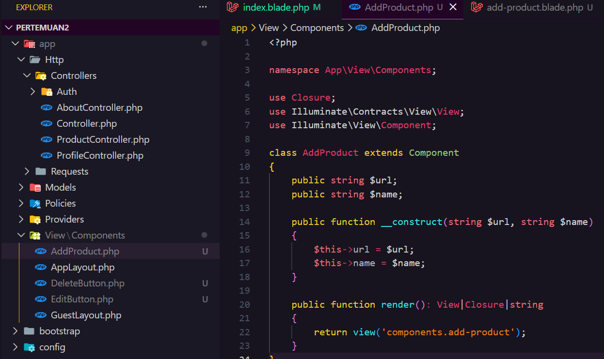

---

# 2. Component Edit Button

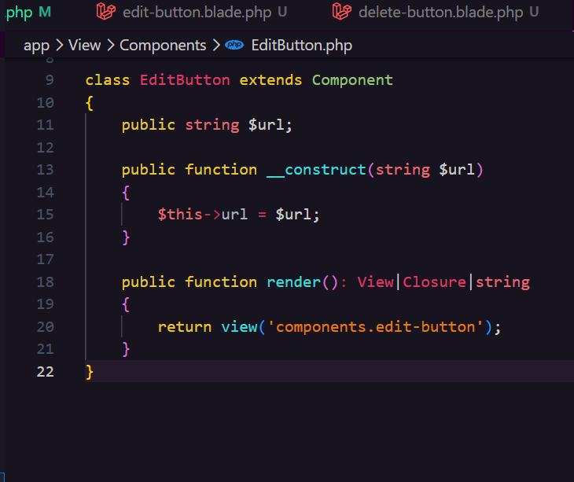

---

# 3. Component Delete Button

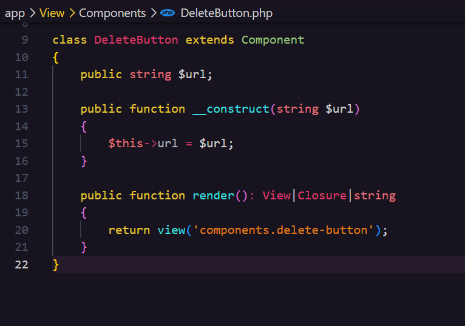

---

# 4. View Component Add Product

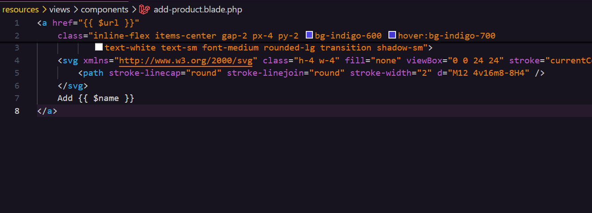

---

# 5. View Component Edit Button

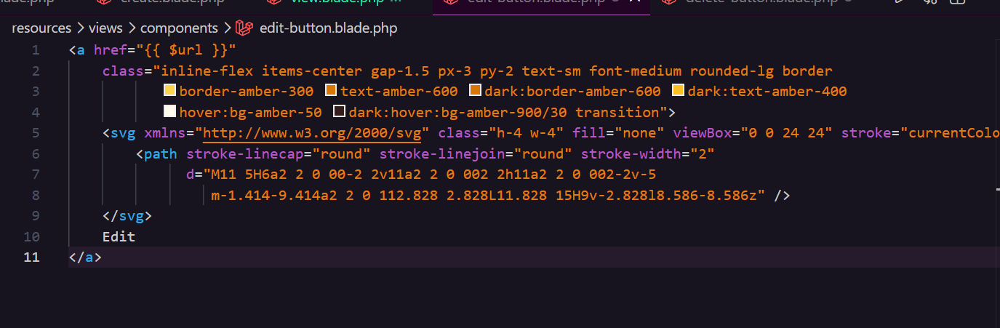

---

# 6. View Component Delete Button

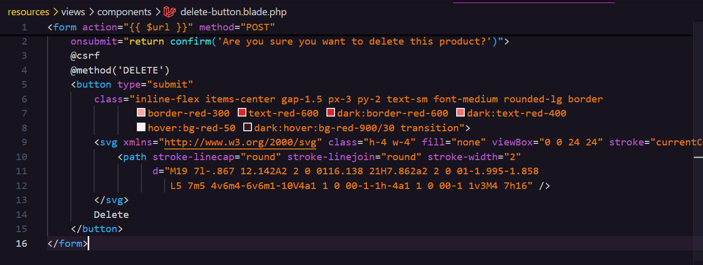

---

# 7. Penggunaan Component (Manage Product)

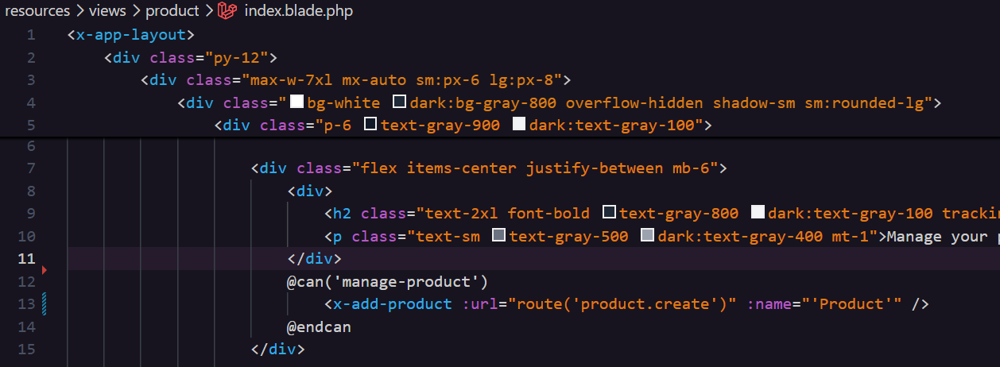

---

# 8. Penggunaan Component (Update & Delete - Index)

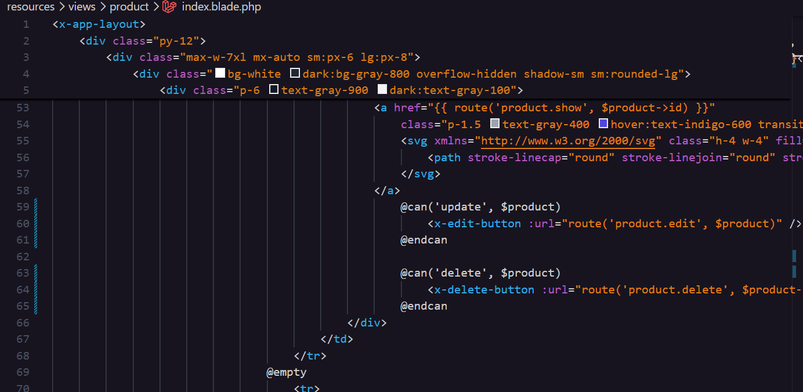

---

# 9. Penggunaan Component (View Product)

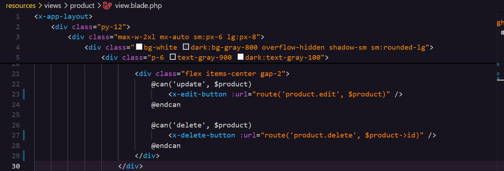

---

# 10. Hasil Halaman Product

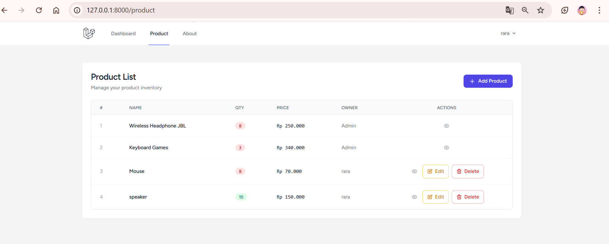

---

# 11. Hasil Halaman View

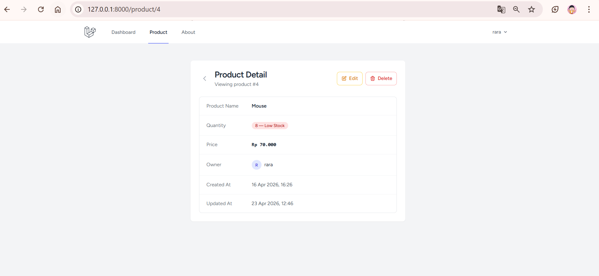
