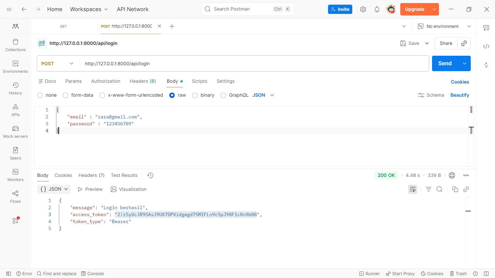
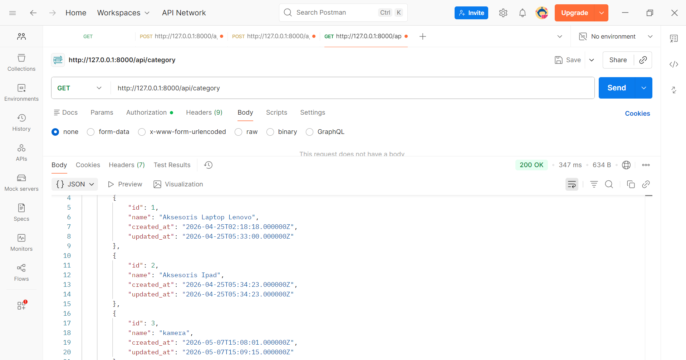
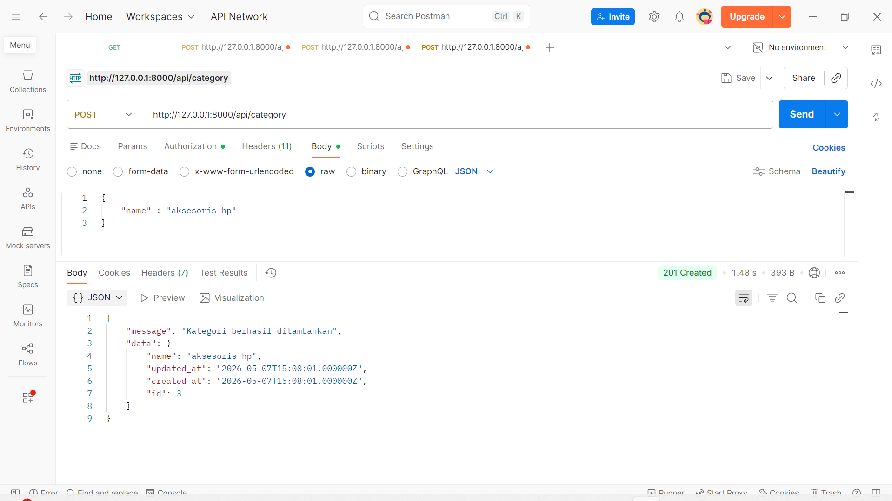
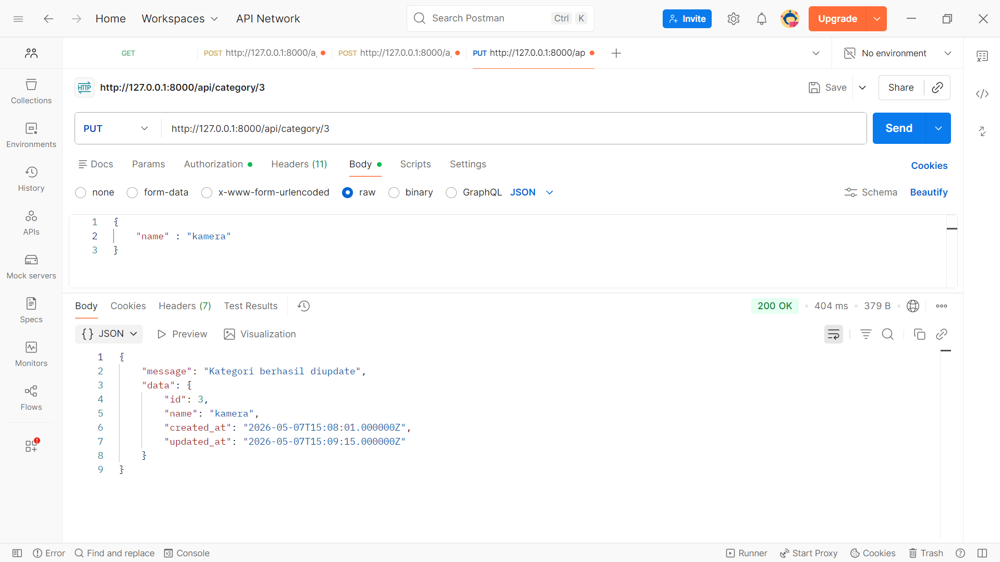
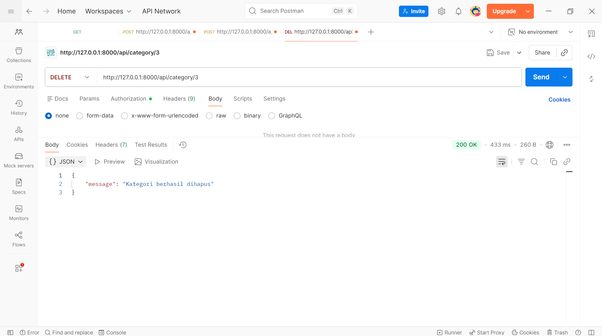
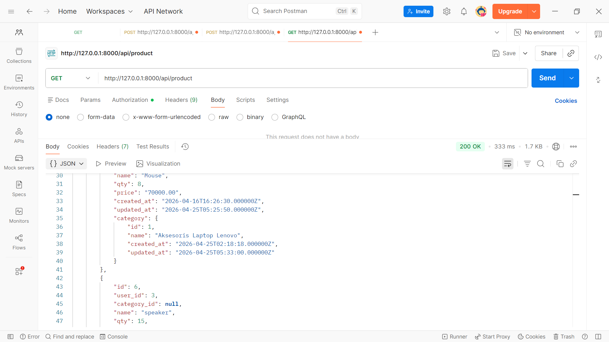
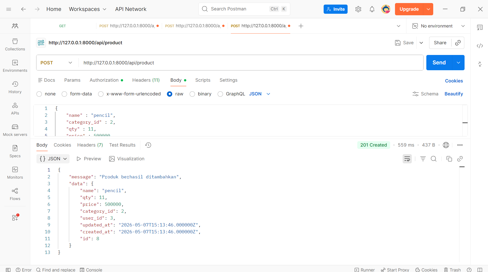
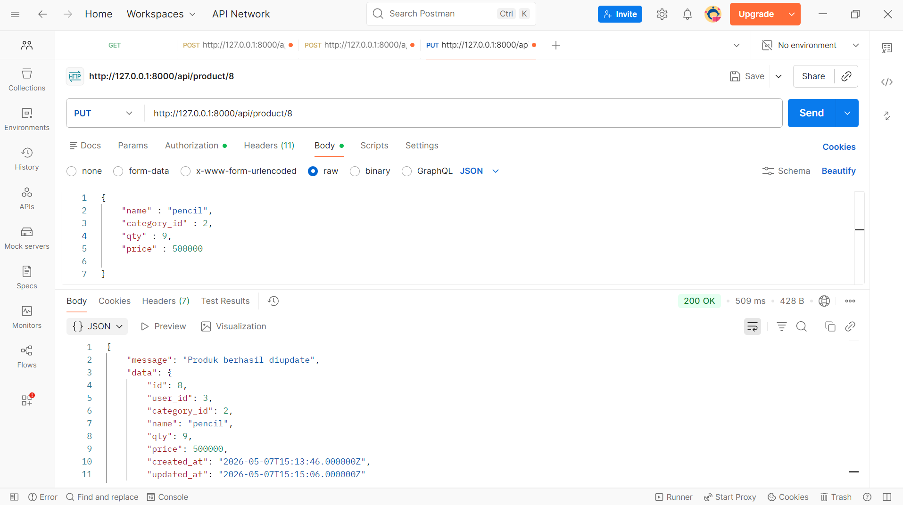
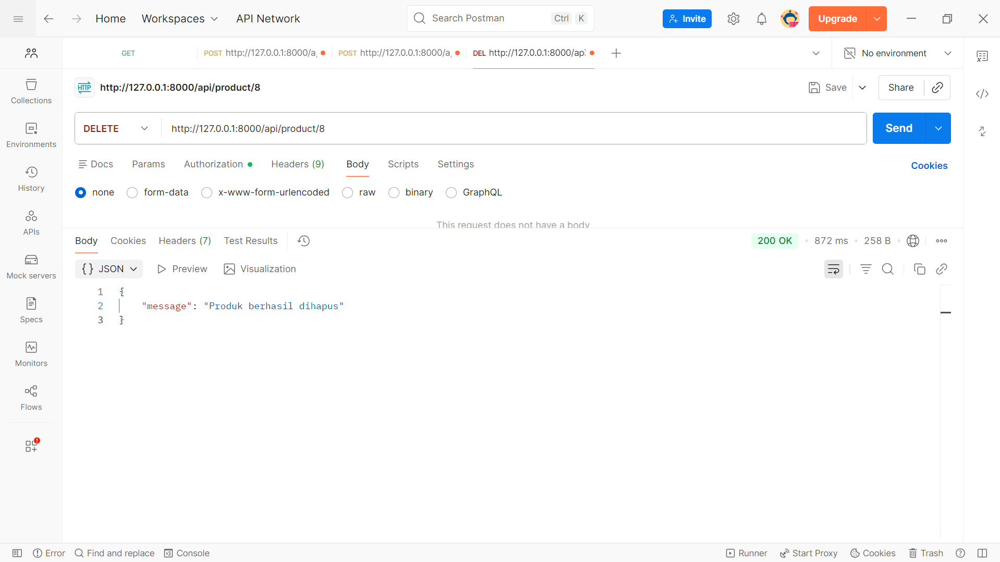

# Praktikum Web Framework - Pertemuan 9
## Dara Syauqi Darmawan - 20230140140
## API Testing Product & Category

# 1. POST Login

---

# 2. GET Category

---

# 3. GET (By ID) Category

-category-prak9.png)

---

# 4. POST Category

---

# 5. PUT Category

---

# 6. DELETE Category

---

# 7. GET Product

---

# 8. GET (By ID) Product

-product-prak9.png)

---

# 9. POST Product

---

# 10. PUT Product

---

# 11. DELETE Product

---
